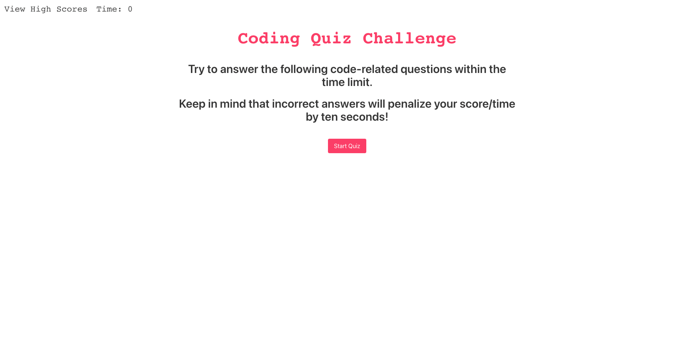

# javascriptQuiz
A short five question timed quiz on JavaScript fundamentals that stores high-scores to see progress of myself and my peers. Styled with Bulma.
If you have any questions about the repo, open an issue or contact me directly at jaimemarsh19@gmail.com. You can find more of my work at my https://github.com/jaimemarsh

No need for installation, just go to the link to take the quiz! 
Link to deployed site: https://jaimemarsh.github.io/javascriptQuiz/
